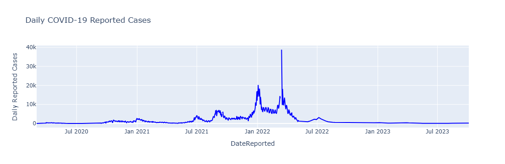
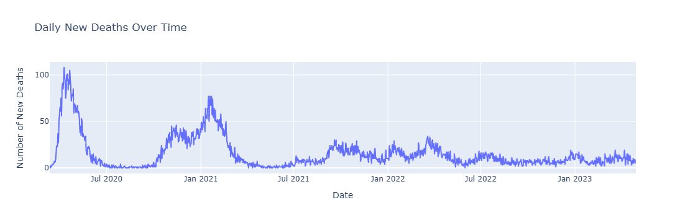
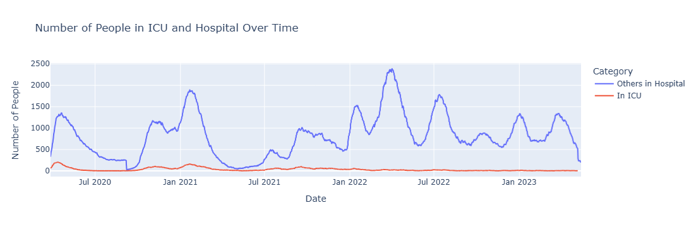

# Project Overview and Outcome

  
   
  <em>Figure 1: Daily confirmed COVID-19 cases in Scotland (early 2020–late 2023), showing major waves including the Omicron surge.</em>

 

  
   
  <em>Figure 2: Daily number of COVID-19–related deaths in Scotland from early 2020 through late 2023.</em>

  
   
  <em>Figure 3: Hospital and ICU admissions from early 2020 till late 2023.</em>

In this project I identified the causes for the rise in COVID-19 cases during the Omicron wave, which began at the end of 2021 and lasted in Scotland through the first few months of 2022. Upon reviewing various line graphs presenting the cumulative number of people vaccinated with the first two doses, it was evident that most of the population had received two doses of COVID-19 vaccines by the end of 2021. At that time, the vaccination drive for the third dose (booster) was underway but was not completed until the first quarter of 2022.

When examining the daily number of COVID-19 cases, the data showed an exponential rise in cases during the first quarter of 2022, surpassing the numbers seen in previous waves. Further investigation revealed that the Omicron variant was responsible for this surge. A literature review indicated that the Omicron variant had enhanced transmissibility due to mutations in its spike proteins, which allowed it to spread more rapidly despite being less likely to cause severe illness compared to earlier variants.

Additionally, analysis of hospitalization and ICU admission graphs showed that, despite the surge in daily cases, ICU admissions remained relatively low compared to previous waves of the pandemic. This aligns with the understanding that Omicron, while more infectious, generally caused milder illness.

The increased number of infections, despite widespread vaccination, can be attributed to the nature of the vaccines used. The primary vaccine in Scotland was Pfizer, an mRNA vaccine that encodes the spike protein of earlier variants of the COVID-19 virus. Because Omicron's spike protein had mutated, it was better able to infect vaccinated individuals. However, these infections were less severe, likely due to the immunity conferred by previous vaccinations, which helped reduce the risk of severe outcomes compared to earlier variants.
